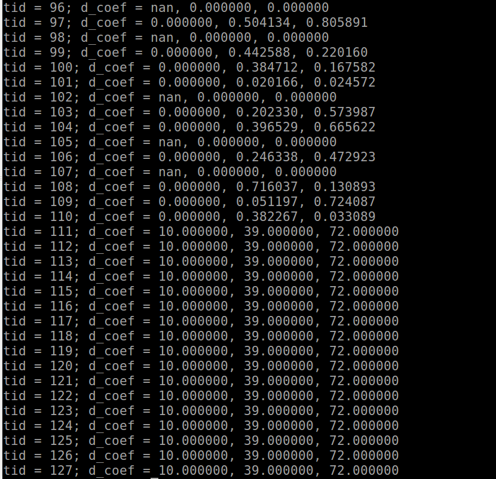

在我的项目中，我想让每个thread进行一系列矩阵运算，google后知道可以在kernel中调用cublas库进行矩阵的操作，但是结果很奇怪，编译完之后，重复运行同一个程序，结果相差很多，因为在网上看到说GPU的精度确实比较低，所以怀疑是精度问题还是程序本身的问题。

为了进一步找bug，我简化了原先的程序，只实现一个矩阵乘以向量的操作，每个thread进行的是同样的矩阵操作。
```c++
#include <stdio.h>
#include <stdlib.h>

#include <cuda_runtime.h>
#include <cublas_v2.h>

__global__ void kernel(const double *d_X, const double *d_Y, const int n, const int p)
{
  int tid = threadIdx.x + blockIdx.x * blockDim.x;

  cublasHandle_t cublasH = NULL;
  cublasStatus_t cublas_status = cublasCreate_v2(&cublasH);
  double alpha = 1.0, beta = 0.0;
  // X'Y (X is n*p, Y is n*1)
  double *d_coef = (double*)malloc(sizeof(double)*p);
  //__syncthreads();应该不用加，不存在对share memory和global memory的写入。
  cublas_status = cublasDgemv(cublasH, CUBLAS_OP_T,
                           n, p,
                           &alpha,
                           d_X, n,
                           d_Y, 1,
                           &beta,
                           d_coef, 1);
   //__syncthreads(); 应该不用加，不存在对share memory和global memory的写入。
   if (cublas_status == CUBLAS_STATUS_SUCCESS)
    printf("tid = %d; d_coef = %f, %f, %f\n", tid, d_coef[0], d_coef[1], d_coef[2]);
   else
    printf("wrong!\n");
   cublasDestroy_v2(cublasH);
   free(d_coef);
}

int main(int argc, char const *argv[]) {
  double A[] = {1, 1, 1, 1, 2, 3, 5, 4, 3, 6, 7, 9};
  double B[] = {1, 2, 3, 4};
  double *d_A, *d_B;
  int n = 4, p = 3;
  int threadsPerBlock = 64;
  int blocksPerGird = 2;
  cudaMalloc((void**)&d_A, sizeof(double)*n*p);
  cudaMalloc((void**)&d_B, sizeof(double)*n);
  cudaMemcpy(d_A, A, sizeof(double)*n*p, cudaMemcpyHostToDevice);
  cudaMemcpy(d_B, B, sizeof(double)*n, cudaMemcpyHostToDevice);
  kernel<<<blocksPerGird, threadsPerBlock>>>(d_A, d_B, n, p);
  cudaDeviceReset();
  return 0;
}
```

但是很不幸，运行完之后，每次结果都会不一样，



所以我想知道这种情况是因为精度原因，还是什么其他的原因？
